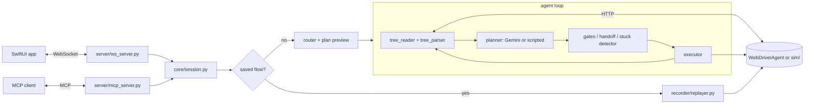

# Spectra

Spectra is an iOS agent that reads the accessibility tree instead of screenshots. It gets each
screen from WebDriverAgent as structured elements (`Cell "Wi-Fi"`, `Button "Send"`), compresses
them into a few hundred characters, asks Gemini for the next action as a function call, and
executes it through WDA. A SwiftUI app on the simulator is the front end: you type or speak a
task, watch the steps, and approve anything sensitive.

It started as a YHack 2026 project built by a team of four (tag [`v0.1-yhack`](docs/releases/v0.1-yhack.md)).
This repo is Krish's continuation: the hackathon history is kept intact, and the post-hackathon
work sits on top of it, measured against a mock device (see
[Since the hackathon](#since-the-hackathon)).

Demo video from the hackathon: **[youtube.com/watch?v=_koDR96GIto](https://www.youtube.com/watch?v=_koDR96GIto)**



## Quickstart (no key, no simulator)

```bash
make setup          # uv sync --frozen (needs network once)
make demo           # four tasks on the mock device with the scripted planner
make test           # unit + integration tests, sockets limited to localhost
make demo-offline   # the demo with the whole process tree sandboxed (macOS)
```

`make demo` starts the mock device (`sim/`) as its own process. Each task then runs in a
separate process through the real server pipeline: workflow cache, router, plan preview, agent
loop, confirmation gate, recorder. Only the model is replaced, by `ScriptedPlanner`, which
answers from fixtures in `sim/scenarios/`. The four tasks are:

- turn on Dark Mode
- add a reminder
- text Mom (the gate stops before Send)
- read a stock price and text it to someone (cross-app memory)

`make demo-offline` and `make e2e-offline` run under `scripts/offline-run`. That is
`sandbox-exec` with outbound network denied except localhost, and keys unset. An egress canary
runs inside the mock device and inside every agent process, and the demo fails if any of them can
reach an external host. `make canary-check` is the companion test that shows the canary does
connect when it isn't sandboxed. CI does the same on Linux inside a `--network none` container.

## Running it on a simulator

You need macOS with Xcode, a booted iOS simulator, WebDriverAgent, Python 3.11+ and a Gemini key.

```bash
cp .env.example .env                  # set GEMINI_API_KEY
make setup
xcrun simctl boot "iPhone 17 Pro" && open -a Simulator
xcodebuild -project /path/to/WebDriverAgent.xcodeproj -scheme WebDriverAgentRunner \
  -destination "platform=iOS Simulator,name=iPhone 17 Pro" test     # WDA on :8100
.venv/bin/python scripts/run_server.py                               # WebSocket on :8765
```

Then build and run `ios/Spectra/Spectra.xcodeproj` on the same simulator.
`scripts/restart_all.sh` does all of it in one go; set `SIM_UDID` and `WDA_PROJ` first.

Other ways in:
- From Python without the app:
  `.venv/bin/python -c "from core.agent import run_task; run_task('Open General settings')"`.
  Approvals happen in the terminal.
- From an MCP client: `.venv/bin/python -m server.mcp_server` (streamable HTTP on
  `127.0.0.1:8766/mcp`) or `--transport stdio`.

Environment variables:

| variable | used for |
|---|---|
| `GEMINI_API_KEY` | the Gemini planner |
| `SPECTRA_PLANNER` | `gemini` (default) or `scripted` |
| `SPECTRA_WDA_URL` | WDA address for the MCP server and tree reader tests (default `http://localhost:8100`) |
| `WDA_PROJ`, `SIM_UDID` / `SIM_DEVICE` | where the server finds WebDriverAgent when it restarts it |
| `SPECTRA_DATA_DIR` | where `lessons.json` lives (default `data/`) |

## How it works

[docs/design.md](docs/design.md) has the details. In short:

1. `core/tree_reader.py` pulls the tree from WDA. It falls back to a gridded screenshot when the
   tree is missing or has fewer than three elements.
2. `core/tree_parser.py` keeps interactive and structural elements and gives each a ref, e.g.
   `[3] Button "Dark" → "0"`.
3. `core/planner.py` sends that to Gemini with 18 tools, including tap, type_text, scroll,
   open_app, remember, batch, handoff, ask_user, schedule and done.
4. `core/gates.py` pauses before sensitive taps, unless the task asked for exactly that action.
   `core/stuck_detector.py` catches loops without the model.
5. `core/executor.py` performs the action through WDA.

Around the loop, `core/session.py` runs a task end to end:
- It checks `flows/` for a saved recording of the same task and replays it without the model.
- Otherwise it routes the task to apps, previews a plan for multi-app work, and runs the loop
  while recording a new flow.

Lessons from failed runs go to `data/lessons.json` and come back in later prompts. The WebSocket
server also runs the passive observer, context triggers and the scheduler.

## Since the hackathon

### Cleanup by Akshay (August 2026)

Akshay flattened the repo from `spectra/` to the root and removed a submodule pointer with no
`.gitmodules` behind it. He also purged the committed Xcode build cache, made
`scripts/restart_all.sh` portable, and added the demo video. Those commits are kept as he made
them.

### Krish's v0.2

The hackathon build couldn't run without a phone and a key, and nothing measured whether a change
helped. Most of v0.2 is about fixing that; the rest is fixes and the features the PRD left for
later.

- Keyless runs: the planner is now injectable (`PlannerProtocol`, `GeminiPlanner`,
  `ScriptedPlanner`). Before, `run_agent()` always built the Gemini planner. `sim/` is a mock WDA
  device with seeded resets and a ground-truth `/_sim/state`.
- An eval harness, `bench/run_suite.py`, runs the same scenarios and seeds against the
  `v0.1-yhack` tree, that tree plus one bug fix, and HEAD. Every trial starts from fresh lessons,
  flows, HOME and device state, and all of them are hashed into the manifest. Success is read from
  the device, not from the agent's own `done`.
- Bugs the harness found:
  - The server opened the new recording before checking the workflow cache. So every task was
    offered itself as a saved match, and a "yes" replayed zero steps and reported success.
  - Replays skipped the confirmation gate.
  - Recordings lacked the router's app launch.
  - Flows that typed a value read off the screen replayed the stale value.
- Replay matching builds on Akshay's exact/fuzzy/position matcher from the hackathon. It
  adds confidence scores, label normalisation, identifier matching and an ambiguity cut. Weak steps
  go to the planner for that one step instead of being tapped on a guess.
- Tree parser v2 keeps standalone text such as alert bodies and section headers, stops
  repeating labels, and skips zero-size elements.
- Hardening carried over from the hackathon tree:
  - The stuck detector tracks element labels.
  - The prompt has an iOS-controls section.
  - The passive observer pauses during tasks.
  - WDA restarts when `source()` slows down.
  - A stale snapshot is no longer used after a handoff.

  None of these has been measured: the mock device has no latency model, and none of the numbers
  below support them.
- An MCP server, and scheduler tests ported from Krish's hackathon time-triggers branch.
  Main's scheduler, from the team's final commit, was kept.

The full list is in [CHANGELOG.md](CHANGELOG.md).

### Results

Everything here comes from files in `bench/results/`, each with a run manifest.

**Tree serialization** (`make bench-tree`,
[bench/results/tree-tokens](bench/results/tree-tokens/summary.json)). These are 52 mock-device
screens across four seeds. The XML is synthetic: shaped like WDA output, generated by `sim/`, not
captured from a simulator. So read the ratios as properties of this XML, not of real apps. Token
counts are chars/4 estimates; no Gemini count was available for this run.

| | mean chars | est. tokens | vs raw | interactive elements kept | standalone text kept |
|---|---|---|---|---|---|
| raw WDA XML | 10,053 | 2,513 | 1.0x | 100% | 95.3%* |
| v0.1 compact tree | 312 | 78 | 32.2x | 100% | 67.4% |
| v0.2 compact tree | 315 | 79 | 32.0x | 100% | 100% |

\*XML escaping (`&amp;`) hides a few strings from the text search. The text-retention metric
counts exactly the text v0.2 was changed to keep, so the 100% says v0.2 does what it was changed
to do, not that it is better in general. What it cost is about 1% more characters.

**Replay after the UI changes** (`make bench-replay`,
[bench/results/replay-heal](bench/results/replay-heal/summary.json)). Each scenario is recorded on
two seeds, then replayed without the model under three conditions:

- the same seed;
- a reshuffled seed, where list order changes and an update banner shifts Settings rows;
- a relabel variant, where Display & Brightness, Send and the message field are renamed.

All three configurations use the v0.2 replayer and differ only in the matcher and the fallback. A
silent failure is a replay whose report said every step passed while the device ended in the
wrong state.

| matcher | same seed | reshuffled | relabeled | silent failures (relabeled) |
|---|---|---|---|---|
| v0.1 three-tier | 6/8 | 5/8 | 3/8 | 2 |
| v0.2 scored | 6/8 | 5/8 | 5/8 | 0 |
| v0.2 scored + planner fallback | 6/8 | 6/8 | 6/8 | 0 |

- In both v0.1 silent failures, the position tier sent the text to the wrong conversation.
- The two misses in every column are the stock-price flows. They are refused on purpose because
  they typed a value read at record time. Without that rule they "pass" with a stale price.
- The step the fallback recovered in each changed condition was a notification
  alert the recording never saw.
- `ScriptedPlanner` stood in for Gemini, so this shows the mechanism
  working, not how well Gemini does that step.

**Live agent eval, v0.1-yhack vs v0.1-yhack+cachefix vs HEAD:** _live eval pending._ The harness
and `make bench-live` are wired up and tested against a local fake Gemini endpoint
(`make bench-live-check`, a harness check only). The Gemini key available on this machine was
rejected by the API, so there are no live numbers yet. When the run exists, its
`bench/results/live-paired/summary.md` goes here.

Both arms will run on this machine's Python 3.11 with google-genai 2.25.0 and facebook-wda 1.5.4.
The hackathon build used google-genai 1.47.0 on Python 3.9. The v0.1 tree runs unmodified except
for one shim on `PATH` (`sim/bin/xcrun`), because its executor launches apps with `xcrun simctl`
rather than over WDA.

## Limitations

- The iOS app was not built or run for this version; there's no Xcode on the machine it was
  developed on. The Swift sources are unchanged from the hackathon.
- The mock device only has four apps and no latency model. It checks that the logic works, not
  how the agent does on real apps.
- No live Gemini numbers yet (see above).
- Safari and the macOS Safari-extension agent aren't covered by the mock or the tests.
- The passive observer, context triggers and sequence suggestions still call Gemini directly
  rather than through the planner interface, so they don't run keyless.
- The license covers the whole repository, including teammates' hackathon code; see Credits.

## Repository layout

```text
core/        agent loop, planner (Gemini + scripted), parser, reader, executor, gates, memory, session
server/      WebSocket server for the iOS app, MCP server
recorder/    .spectra recorder, replayer, scored matcher
context/     passive observer, episode store, context triggers (team, hackathon)
sim/         mock WDA device, scenario fixtures + script engine, fake Gemini endpoint, egress canary
bench/       eval harness, tree and replay benchmarks, committed results
ios/         SwiftUI client
macos/       Safari extension agent (team, hackathon)
examples/    five recordings from the hackathon demo
```

## Credits

Built at YHack 2026 by Krish Maheshwari ([@krishmdev](https://github.com/krishmdev)), Akshay
Irudayaraj ([@akshayirudayaraj](https://github.com/akshayirudayaraj)),
[@vsangireddy27](https://github.com/vsangireddy27) and a fourth teammate.

- Krish wrote the first version of the agent core, the WebSocket server and the iOS app.
- The team added the workflow cache and record/replay (including the original matcher), context
  triggers, the Safari agent, notifications and the scheduler.
- Akshay's cleanup is described above; the v0.2 work is Krish's.
- The team's own repo is [akshayirudayaraj/spectra](https://github.com/akshayirudayaraj/spectra).

## License

MIT, see [LICENSE](LICENSE).
